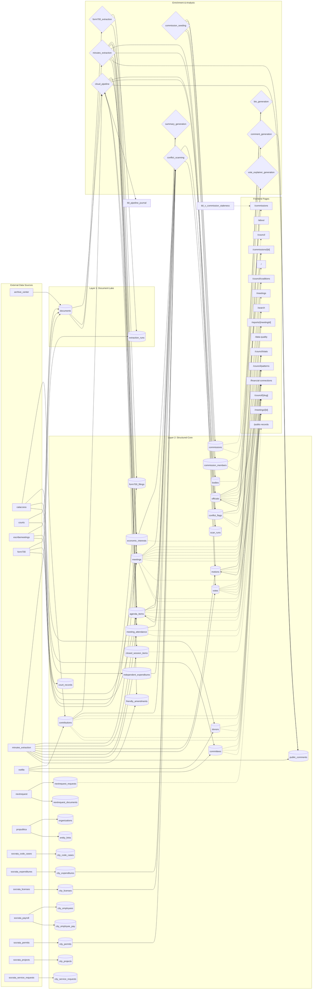

# Pipeline Lineage Diagram

_Auto-generated by `pipeline_map.py diagram`. Do not edit manually._

```mermaid
flowchart LR

  %% ── External Sources ──────────────────────────────
  subgraph Sources["External Data Sources"]
    src_archive_center["archive_center"]
    src_calaccess["calaccess"]
    src_courts["courts"]
    src_escribemeetings["escribemeetings"]
    src_form700["form700"]
    src_minutes_extraction["minutes_extraction"]
    src_netfile["netfile"]
    src_nextrequest["nextrequest"]
    src_propublica["propublica"]
    src_socrata_code_cases["socrata_code_cases"]
    src_socrata_expenditures["socrata_expenditures"]
    src_socrata_licenses["socrata_licenses"]
    src_socrata_payroll["socrata_payroll"]
    src_socrata_permits["socrata_permits"]
    src_socrata_projects["socrata_projects"]
    src_socrata_service_requests["socrata_service_requests"]
  end

  subgraph Layer1["Layer 1: Document Lake"]
    tbl_documents[("documents")]
    tbl_extraction_runs[("extraction_runs")]
  end

  subgraph Layer2["Layer 2: Structured Core"]
    tbl_agenda_items[("agenda_items")]
    tbl_bodies[("bodies")]
    tbl_city_code_cases[("city_code_cases")]
    tbl_city_employee_pay[("city_employee_pay")]
    tbl_city_employees[("city_employees")]
    tbl_city_expenditures[("city_expenditures")]
    tbl_city_licenses[("city_licenses")]
    tbl_city_permits[("city_permits")]
    tbl_city_projects[("city_projects")]
    tbl_city_service_requests[("city_service_requests")]
    tbl_closed_session_items[("closed_session_items")]
    tbl_commission_members[("commission_members")]
    tbl_commissions[("commissions")]
    tbl_committees[("committees")]
    tbl_conflict_flags[("conflict_flags")]
    tbl_contributions[("contributions")]
    tbl_court_records[("court_records")]
    tbl_donors[("donors")]
    tbl_economic_interests[("economic_interests")]
    tbl_entity_links[("entity_links")]
    tbl_form700_filings[("form700_filings")]
    tbl_friendly_amendments[("friendly_amendments")]
    tbl_independent_expenditures[("independent_expenditures")]
    tbl_meeting_attendance[("meeting_attendance")]
    tbl_meetings[("meetings")]
    tbl_motions[("motions")]
    tbl_nextrequest_documents[("nextrequest_documents")]
    tbl_nextrequest_requests[("nextrequest_requests")]
    tbl_officials[("officials")]
    tbl_organizations[("organizations")]
    tbl_public_comments[("public_comments")]
    tbl_scan_runs[("scan_runs")]
    tbl_votes[("votes")]
  end

  subgraph Enrichments["Enrichment & Analysis"]
    enr_bio_generation{"bio_generation"}
    enr_cloud_pipeline{"cloud_pipeline"}
    enr_comment_generation{"comment_generation"}
    enr_commission_seeding{"commission_seeding"}
    enr_conflict_scanning{"conflict_scanning"}
    enr_form700_extraction{"form700_extraction"}
    enr_minutes_extraction{"minutes_extraction"}
    enr_summary_generation{"summary_generation"}
    enr_vote_explainer_generation{"vote_explainer_generation"}
  end

  subgraph Frontend["Frontend Pages"]
    page_["/"]
    page_about["/about"]
    page_commissions["/commissions"]
    page_commissions_id["/commissions/[id]"]
    page_council["/council"]
    page_council_slug["/council/[slug]"]
    page_council_coalitions["/council/coalitions"]
    page_council_patterns["/council/patterns"]
    page_council_stats["/council/stats"]
    page_data-quality["/data-quality"]
    page_financial-connections["/financial-connections"]
    page_meetings["/meetings"]
    page_meetings_id["/meetings/[id]"]
    page_public-records["/public-records"]
    page_reports_meetingId["/reports/[meetingId]"]
    page_search["/search"]
  end

  %% ── Source → Table edges ─────────────────────────
  src_archive_center --> tbl_documents
  src_calaccess --> tbl_contributions
  src_calaccess --> tbl_donors
  src_calaccess --> tbl_committees
  src_calaccess --> tbl_independent_expenditures
  src_courts --> tbl_documents
  src_courts --> tbl_court_records
  src_escribemeetings --> tbl_documents
  src_escribemeetings --> tbl_meetings
  src_escribemeetings --> tbl_agenda_items
  src_form700 --> tbl_documents
  src_form700 --> tbl_form700_filings
  src_form700 --> tbl_economic_interests
  src_minutes_extraction --> tbl_extraction_runs
  src_minutes_extraction --> tbl_meetings
  src_minutes_extraction --> tbl_agenda_items
  src_minutes_extraction --> tbl_motions
  src_minutes_extraction --> tbl_votes
  src_minutes_extraction --> tbl_meeting_attendance
  src_minutes_extraction --> tbl_closed_session_items
  src_minutes_extraction --> tbl_public_comments
  src_minutes_extraction --> tbl_friendly_amendments
  src_netfile --> tbl_contributions
  src_netfile --> tbl_donors
  src_netfile --> tbl_committees
  src_nextrequest --> tbl_nextrequest_requests
  src_nextrequest --> tbl_nextrequest_documents
  src_propublica --> tbl_organizations
  src_propublica --> tbl_entity_links
  src_socrata_code_cases --> tbl_city_code_cases
  src_socrata_expenditures --> tbl_city_expenditures
  src_socrata_licenses --> tbl_city_licenses
  src_socrata_payroll --> tbl_city_employees
  src_socrata_payroll --> tbl_city_employee_pay
  src_socrata_permits --> tbl_city_permits
  src_socrata_projects --> tbl_city_projects
  src_socrata_service_requests --> tbl_city_service_requests

  %% ── Enrichment edges ─────────────────────────────
  tbl_officials --> enr_bio_generation
  enr_bio_generation --> tbl_officials
  tbl_documents --> enr_cloud_pipeline
  tbl_contributions --> enr_cloud_pipeline
  tbl_meetings --> enr_cloud_pipeline
  tbl_agenda_items --> enr_cloud_pipeline
  enr_cloud_pipeline --> tbl_meetings
  enr_cloud_pipeline --> tbl_agenda_items
  enr_cloud_pipeline --> tbl_conflict_flags
  enr_cloud_pipeline --> tbl_scan_runs
  enr_cloud_pipeline --> tbl_public_comments
  enr_cloud_pipeline --> tbl_pipeline_journal
  tbl_conflict_flags --> enr_comment_generation
  enr_comment_generation --> tbl_public_comments
  enr_commission_seeding --> tbl_commissions
  enr_commission_seeding --> tbl_commission_members
  enr_commission_seeding --> tbl_bodies
  enr_commission_seeding --> tbl_officials
  tbl_meetings --> enr_conflict_scanning
  tbl_meeting_attendance --> enr_conflict_scanning
  tbl_agenda_items --> enr_conflict_scanning
  tbl_contributions --> enr_conflict_scanning
  tbl_economic_interests --> enr_conflict_scanning
  tbl_city_expenditures --> enr_conflict_scanning
  tbl_independent_expenditures --> enr_conflict_scanning
  tbl_city_permits --> enr_conflict_scanning
  tbl_city_licenses --> enr_conflict_scanning
  enr_conflict_scanning --> tbl_conflict_flags
  enr_conflict_scanning --> tbl_scan_runs
  tbl_documents --> enr_form700_extraction
  enr_form700_extraction --> tbl_form700_filings
  enr_form700_extraction --> tbl_economic_interests
  tbl_documents --> enr_minutes_extraction
  enr_minutes_extraction --> tbl_extraction_runs
  enr_minutes_extraction --> tbl_meetings
  enr_minutes_extraction --> tbl_agenda_items
  enr_minutes_extraction --> tbl_motions
  enr_minutes_extraction --> tbl_votes
  enr_minutes_extraction --> tbl_meeting_attendance
  enr_minutes_extraction --> tbl_closed_session_items
  enr_minutes_extraction --> tbl_public_comments
  enr_minutes_extraction --> tbl_friendly_amendments
  tbl_agenda_items --> enr_summary_generation
  enr_summary_generation --> tbl_agenda_items
  tbl_motions --> enr_vote_explainer_generation
  enr_vote_explainer_generation --> tbl_motions

  %% ── Table → Page edges (via queries) ────────────
  tbl_agenda_items -.-> page_council_stats
  tbl_agenda_items -.-> page_meetings_id
  tbl_agenda_items -.-> page_reports_meetingId
  tbl_agenda_items -.-> page_search
  tbl_bodies -.-> page_commissions_id
  tbl_closed_session_items -.-> page_meetings_id
  tbl_commission_members -.-> page_commissions
  tbl_commission_members -.-> page_commissions_id
  tbl_commissions -.-> page_commissions
  tbl_commissions -.-> page_commissions_id
  tbl_committees -.-> page_council_slug
  tbl_committees -.-> page_council_patterns
  tbl_committees -.-> page_financial-connections
  tbl_conflict_flags -.-> page_council_stats
  tbl_conflict_flags -.-> page_financial-connections
  tbl_conflict_flags -.-> page_reports_meetingId
  tbl_contributions -.-> page_council_slug
  tbl_contributions -.-> page_council_patterns
  tbl_contributions -.-> page_council_stats
  tbl_contributions -.-> page_financial-connections
  tbl_donors -.-> page_council_slug
  tbl_donors -.-> page_financial-connections
  tbl_economic_interests -.-> page_council_slug
  tbl_meeting_attendance -.-> page_council_slug
  tbl_meeting_attendance -.-> page_meetings_id
  tbl_meetings -.-> page_
  tbl_meetings -.-> page_commissions_id
  tbl_meetings -.-> page_council_coalitions
  tbl_meetings -.-> page_council_patterns
  tbl_meetings -.-> page_council_stats
  tbl_meetings -.-> page_meetings
  tbl_meetings -.-> page_meetings_id
  tbl_meetings -.-> page_reports_meetingId
  tbl_meetings -.-> page_search
  tbl_motions -.-> page_financial-connections
  tbl_motions -.-> page_meetings_id
  tbl_nextrequest_requests -.-> page_public-records
  tbl_officials -.-> page_council
  tbl_officials -.-> page_council_slug
  tbl_officials -.-> page_council_coalitions
  tbl_officials -.-> page_council_patterns
  tbl_officials -.-> page_financial-connections
  tbl_officials -.-> page_search
  tbl_v_commission_staleness -.-> page_commissions
  tbl_votes -.-> page_council_slug
  tbl_votes -.-> page_council_coalitions
  tbl_votes -.-> page_council_patterns
  tbl_votes -.-> page_council_stats
  tbl_votes -.-> page_meetings_id
```
